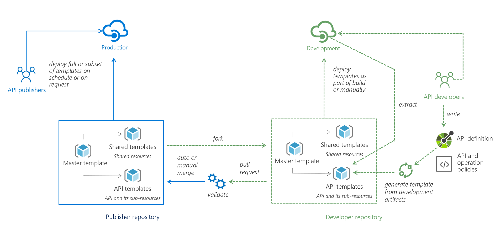

# Azure API Management DevOps Resource Kit

APIs have become mundane. They have become the de facto standard for connecting apps, data, and services. In the larger picture, APIs are driving digital transformation in organizations.

With the strategic value of APIs, a continuous integration (CI) and continuous deployment (CD) pipeline has become an important aspect of API development. It allows organizations to automate deployment of API changes without error-prone manual steps, detect issues earlier, and ultimately deliver value to end users faster.

This repository provides [guidance](./README.md), [examples](./example/), and [tools](./src/README.md) to help you achieve API DevOps with Azure API Management.

> **WARNING**
> This project is entering "maintenance" mode and will soon be retired.  We recommend the following
> actions:
> * If you are using `creator`, switch over to using Bicep templates.  [Bicep](https://learn.microsoft.com/azure/azure-resource-manager/bicep/overview) is a descriptive language for describing infrastructure.  You can find bicep modules for handling API Management APIs at [https://github.com/azure-samples/api-management-sample-apis](https://github.com/azure-samples/api-management-sample-apis).
> * If you are using `extractor`, switch your pipelines over to using [APIOps](https://github.com/azure/apiops).  APIOps applies the concepts of GitOps to API deployments.  It is faster and more flexible than the DevOps Resource Kit.
>
> You are welcome to fork and maintain the DevOps Resource Kit yourself.  However, we will not be doing additional feature releases of the DevOps Resource Kit.

## The Problem

Organizations today normally have multiple deployment environments (e.g., Development, Testing, Production) and use separate API Management instances for each environment. Some of these instances are shared by multiple development teams, who are responsible for different APIs with different release cadence.

As a result, customers often come to us with the following challenges:

* How to automate deployment of APIs into API Management?
* How to migrate configurations from one environment to another?
* How to avoid interference between different development teams who share the same API Management instance?

We believe the approach described below will address all these challenges.

## CI/CD with API Management

The proposed approach is illustrated in the below picture. You can also [watch this video](https://www.youtube.com/watch?v=4Sp2Qvmg6j8) which explains the approach as well as demonstrates a sample implementation. 

In this example, there are two deployment environments: Development and Production, each has its own API Management instance. API developers have access to the Development instance and can use it for developing and testing their APIs. The Production instance is managed by a designated team called the API publishers.

The key in this proposed approach is to keep all API Management configurations in Azure [Resource Manager templates](https://docs.microsoft.com/azure/azure-resource-manager/resource-group-authoring-templates). These templates should be kept in a source control system. We will use GIT throughout this example. As illustrated in the picture, there is a Publisher repository that contains all configurations of the Production API Management instance in a collection of templates.

* **Service template**: contains all the service-level configurations of the API Management instance (e.g., pricing tier and custom domains). 
* **Shared templates**: contain shared resources throughout an API Management instance (e.g., groups, products, loggers). 
* **API templates**: include configurations of APIs and their sub-resources (e.g., operations, policies, diagnostics settings). 
* **Master template**: ties everything together by [linking](https://docs.microsoft.com/en-us/azure/azure-resource-manager/resource-group-linked-templates) to all templates and deploy them in order. If we want to deploy all configurations to an API Management instance, we can just deploy the master template. Meanwhile, each template can also be deployed individually.

API developers will fork the publisher repository to a developer repository and work on the changes for their APIs. In most cases, they will focus on the API templates for their APIs and do not need to change the shared or service templates.

We realize there are two challenges for API developers when working with Resource Manager templates:

* First, API developers often work with [OpenAPI Specification](https://github.com/OAI/OpenAPI-Specification) and may not be familiar with Resource Manager schemas. Authoring templates manually might be an error-prone task. Therefore, we created a utility tool called [**Creator**](./src/README.md#Creator) to automate the creation of API templates based on an Open API Specification file. Optionally, developers can supply API Management policies for an API in XML format. Basically, the tool inserts the Open API specification and policies into a Resource Manager template in the proper format. With this tool, API developers can continue focusing on the formats and artifacts they are familiar with.

* Second, for customers who have already been using API Management, another challenge is how to extract existing configurations into Resource Manager templates. For those customers, We have created another tool called [**Extractor**](./src/README.md#extractor) to help them generate templates by extracting configurations from their existing API Management instances. You can view [Supported Resources](./docs/SupportedResources/README.md) to view the supported functionality for each public APIM API version.

Once API developers have finished developing and testing an API, and have generated the API template, they can submit a pull request to merge the changes to the publisher repository. API publishers can validate the pull request and make sure the changes are safe and compliant. For example, they can check if only HTTPS is allowed to communicate with the API. Most of these validations can be automated as a step in the CI/CD pipeline. Once the changes are approved and merged successfully, API publishers can choose to deploy them to the Production instance either on schedule or on demand. The deployment of the templates can be automated using [Github Actions](https://github.com/Azure/apimanagement-devops-samples), [Azure Pipeline](https://docs.microsoft.com/en-us/azure/devops/pipelines/?view=azure-devops), [PowerShell](https://docs.microsoft.com/en-us/azure/azure-resource-manager/resource-group-template-deploy), [Azure CLI](Azure-cli-example.md) or other tools. An example using Azure DevOps can be find [here](docs/AzDO-Example.md)

With this approach, the deployment of API changes into API Management instances can be automated and it is easy to promote changes from one environment to another. Since different API development teams will be working on different sets of API templates and files, it prevents interference between different teams.

We realize our customers bring a wide range of engineering cultures and existing automation solutions. The approach and tools provided here are not meant to be a one-size-fits-all solution. That's why we created this repository and open-sourced everything, so that you can extend and customize the solution.

If you have any questions or feedback, please raise issues in the repository or email us at apimgmt at microsoft. We also started an [FAQ page](./FAQ.md) to answer most common questions.

## Kudos

This project was inspired by Mattias Lögdberg's [API Management ARM Template Creator](http://mlogdberg.com/apimanagement/arm-template-creator) and Eldert Grootenboer's [series of blog posts](https://blog.eldert.net/api-management-ci-cd-using-arm-templates-api-management-instance/) on CI/CD with API Management. We have also received feedback from many members in our community. Thank you to all who have contributed in the project!

## License

This project is licensed under [the MIT License](LICENSE)

This project has adopted the [Microsoft Open Source Code of Conduct](https://opensource.microsoft.com/codeofconduct/). For more information, see the [Code of Conduct FAQ](https://opensource.microsoft.com/codeofconduct/faq/) or contact [opencode@microsoft.com](mailto:opencode@microsoft.com) with any additional questions or comments.

## Support

We provide support through GitHub [Issues] and [Discussions] only.  There is no paid support channel for this tool.  You can also use [Stack Overflow] with the `azure-api-management-devops-resource-kit` tag for community support.

Report bugs or submit feature requests in GitHub [Issues].  Please use one of the provided templates so that we can gather all appropriate information.

## Contributing

This project welcomes contributions and suggestions. Guidance can be found in our [contribution guidelines]. Most contributions require you to agree to a Contributor License Agreement (CLA) declaring that you have the right to, and actually do, grant us the rights to use your contribution. For details, visit https://cla.microsoft.com.

When you submit a pull request, a CLA-bot will automatically determine whether you need to provide a CLA and decorate the PR appropriately (e.g., label, comment). Simply follow the instructions provided by the bot. You will only need to do this once across all repos using our CLA.

This project has adopted the [Microsoft Open Source Code of Conduct](https://opensource.microsoft.com/codeofconduct/).
For more information, see the [Code of Conduct FAQ](https://opensource.microsoft.com/codeofconduct/faq/) or contact [opencode@microsoft.com](mailto:opencode@microsoft.com) with any additional questions or comments.

<!-- Links -->
[Issues]: https://github.com/Azure/azure-api-management-devops-resource-kit/issues
[Discussions]: https://github.com/Azure/azure-api-management-devops-resource-kit/discussions
[Stack Overflow]: https://stackoverflow.com/questions/tagged/azure-api-management-devops-resource-kit
[contribution guidelines]: https://github.com/Azure/azure-api-management-devops-resource-kit/blob/main/CONTRIBUTING.md
