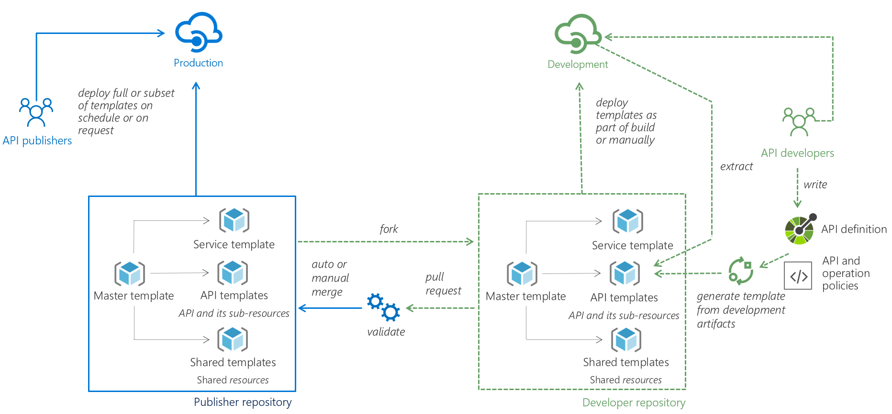

# Azure API Management DevOps Example

This repository contains guidance, examples, and tools to help you achieve API DevOps with Azure API Management.

## Background

Organizations today usually have multiple deployment environments (e.g., development, QA, production) and use separate Azure API Management (APIM) instances for each environment. It is also not uncommon for an APIM instance to be shared by multiple API development teams. Each of these teams is responsible for one or more APIs and has a different release cadence. As a result, organizations who are using APIM often come to us with the following questions:

1. How to automate deployment of APIs into APIM
2. How to promote APIM configurations from one environment to another
3. How to prevent interference between API teams 

In the next section, we propose an approach that aims to address all these questions. 

## API DevOps with API Management

The proposed approach is illustrated in the below picture.

In this example, there are two deployment environments: _Development_ and _Production_, each environment has its own APIM instance. _API developers_ have access to the _Development_ instance and can use it for developing and testing their APIs. The _Production_ instance is managed by a designated team called the _API publishers_.

The key in this proposed approach is to keep all APIM configurations in Azure [Resource Manager templates](https://docs.microsoft.com/azure/azure-resource-manager/resource-group-authoring-templates). The templates should be kept in an [SCM](https://en.wikipedia.org/wiki/Software_configuration_management) system. We will use GIT throughout this example. As illustrated in the picture, there is a _Publisher repository_ that contains all the configurations of the _Production_ APIM instance. _API developers_ can fork and clone the _Publisher repository_ and work on their APIs in their _Developer repository_.

There are three types of templates: the _Service template_ contains all the service-level configurations of the APIM instance (e.g., pricing tier and custom domains). The _Shared templates_ contain shared resources throughout an APIM instance (e.g., groups, products, loggers). For each API, there is an _API template_ that contains all the configurations of the API and its subresources (e.g., API definition, operations, policies, diagnostics settings). Finally, the _Master template_ ties everything together by [linking](https://docs.microsoft.com/en-us/azure/azure-resource-manager/resource-group-linked-templates) to all templates and deploy them in order. Therefore, if we want to deploy all configurations to an APIM instance, we can deploy the _Master template_. We can also choose to deploy each template individually. For instance, if we just want to deploy changes to an API.

There are two obvious challenges of this approach with Resource Manager templates. _API developers_ often work with Open API (formerly known as Swagger) specifications to define their APIs. The first challenge for them is authoring _API templates_, which might be error-prone for people not familiar with Resource Manager templates schema. To tackle this challenge, we will create a template generator** to help developers generate _API templates_ based on Open API specifications. Optionally, developers can also supply APIM policies for an API in XML format. Basically, the tool inserts the Open API specification and policies into a Resource Manager template in the proper format. With this tool, _API developers_ can continue focusing on the formats they are familiar with. For customers who have already been using APIM, the second challenge is how to extract existing configurations into Resource Manager templates. For those customers, we will provide a **second template generator** to help them create _API templates_ by extracting configurations from their existing APIM instances. The tools will be open source and provided through this repository. Customers can extend and customize the tools to their needs.

Once _API developers_ finish developing and testing an API, and have generated the _API template_ for it, they can submit a pull request to merge the changes to the _Publisher repository_. _API publishers_ can validate the pull request and make sure the changes are safe and compliant. Most of the validations can be automated as part of the CI/CD pipeline. Once the changes are approved and merged successfully, _API publishers_ can choose to deploy them to the _Production_ instance either on schedule or on demand. We have provided an [example](Example.md) on how to deploy the templates using Azure CLI.

With this approach, the deployment of API changes into APIM instances can be automated and it is easy to promote changes from one environment to another. Since different API development teams will be working on different sets of API templates and files, it prevents interference between different teams.

We realize our customers bring a wide range of engineering cultures and existing automation solutions. The approach and tools provided here are not meant to be a one-size-fits-all solution. That's why we created this repository and open-sourced everything, so that you can extend and customize the solution.

If you have any questions or feedback, please raise issues in the repository or email us at apimgmt at microsoft. We also started an [FAQ page](./FAQ.md) to answer most common questions. 

## Alternatives

For customers who are just starting out or have simple scenarios, they may not necessarily need to use the template generator and may found it easier to begin with the boilerplate templates we provided in the [example](./example/) folder. 

Customers can also run [PowerShell](https://docs.microsoft.com/powershell/module/azurerm.apimanagement/?view=azurermps-6.13.0) scripts as part of their release process to deploy APIs to APIM. There is also a **non-official** Azure DevOps [extension](https://marketplace.visualstudio.com/items?itemName=stephane-eyskens.apim) created by Azure MVP [Stephane Eyskens]((https://stephaneeyskens.wordpress.com/). 

## License

This project is licensed under [the MIT License](LICENSE)

This project has adopted the [Microsoft Open Source Code of Conduct](https://opensource.microsoft.com/codeofconduct/). For more information, see the [Code of Conduct FAQ](https://opensource.microsoft.com/codeofconduct/faq/) or contact [opencode@microsoft.com](mailto:opencode@microsoft.com) with any additional questions or comments.

## Contributing

This project welcomes contributions and suggestions. Most contributions require you to agree to a Contributor License Agreement (CLA) declaring that you have the right to, and actually do, grant us the rights to use your contribution. For details, visit https://cla.microsoft.com.

When you submit a pull request, a CLA-bot will automatically determine whether you need to provide a CLA and decorate the PR appropriately (e.g., label, comment). Simply follow the instructions provided by the bot. You will only need to do this once across all repos using our CLA.

This project has adopted the [Microsoft Open Source Code of Conduct](https://opensource.microsoft.com/codeofconduct/).
For more information, see the [Code of Conduct FAQ](https://opensource.microsoft.com/codeofconduct/faq/) or contact [opencode@microsoft.com](mailto:opencode@microsoft.com) with any additional questions or comments.
