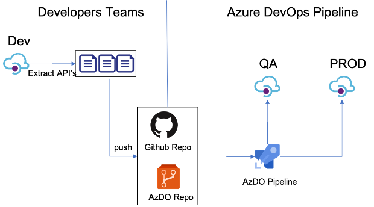
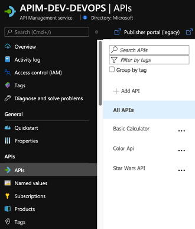
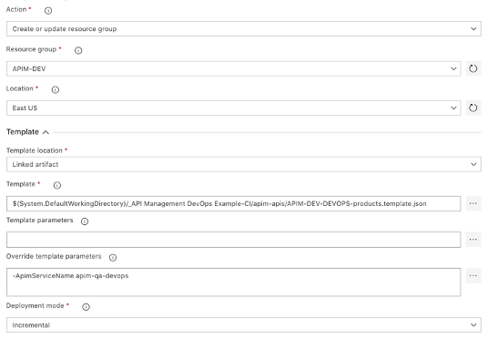
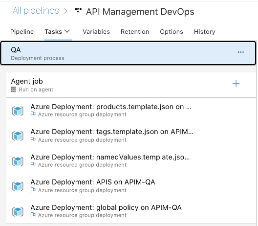
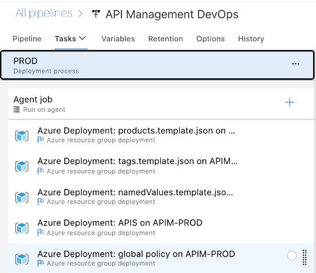
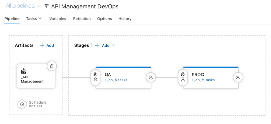

# Continuous Integration and Continuous Deployment using Azure DevOps

The following instructions demonstrate how to deploy the contents of this example repository using Azure DevOps Repos and Azure DevOps Pipelines.

## Pre-reqs

To execute this solution you will need:

- Azure DevOps Account
- An Azure DevOps Repo configured ([how to configure an Azure DevOps Repo](https://docs.microsoft.com/en-us/azure/devops/repos/get-started/sign-up-invite-teammates?view=azure-devops))
- Three API Management deployed (DEV, QA and PROD) ([how to deploy a Create a new Azure API Management service instance](https://docs.microsoft.com/en-us/azure/api-management/get-started-create-service-instance))
- Some API(s) on your API Management ([Add an API manually](https://docs.microsoft.com/en-us/azure/api-management/add-api-manually))

## Architecture



This is one example of how to use Azure DevOps Repo and Azure DevOps Pipelines to enable a Continuous Integration and Continuous Deployment (CI/CD) for API\'s on an Azure API Management Service. There're other ways to do this, but this is a \"Keep it Simple\" to help you start.(Planning to have another version using Github and Github Actions soon).

This is our Development API management. In general, developers will create their API\'s in one instance of APIM to test it.

Create your API's on API Management Development environment. ([How to create API's on API Management](https://docs.microsoft.com/en-us/azure/api-management/import-and-publish))



## APIM DevOps Toolkit

**Running the Extractor**

After a developer creates and tests APIs in API management, it is time to extract those APIs using this DevOps Resource Kit.

Below are the steps to run the extractor from source code:

- Clone this repository and navigate to {path\_to\_folder}/src/APIM\_ARMTemplate/apimtemplate
- Restore its packages using

``` 
dotnet restore 
```

- Make sure you have signed in using Azure CLI and have switched to the subscription containing the API Management instance from which the configurations will be extracted.

```

az login

az account set \--subscription \<subscription\_id\>

```

**Extractor Arguments**

You have two choices when specifying your settings:

1\. By using a json file with key-values where the keys matches the table below. Use the \`extractorConfig\` argument:

\`extract \--extractorConfig c:/temp/extractSettings.json\`. [See more examples.](#extractorParameterFileExamples)

2\. Pass the arguments on the command line. For instance \`extract \--sourceApimName my-feature-apim \--destinationApimName company-stable-apim \--resourceGroup my-feature-rg \--fileFolder c:\\temp\\apim-extract \--apiName MyFeatureV1Api\`.

For this example, we will only use the option \#2

So, run the application with:

```

dotnet run extract --sourceApimName <DEV-APIM-NAME> --destinationApimName <DESTINATION-APIM-NAME> --resourceGroup <RESOURCE-GROUP-NAME> --fileFolder c:\\temp\\apim-extract.

```

Where:

**DEV-APIM-NAME:** API Management where you created your API

**DESTINATION-APIM-NAME:** It\'s just a convention to set the DESTINATION-API-NAME in front of the generated files.

**RESOURCE-GROUP-NAME:** Resource group where the DEV-APIM-NAME is hosted.

***For more information on how to run the application and parameters, [go to this page](https://github.com/Azure/azure-api-management-devops-resource-kit/blob/master/src/README.md#extractor).***

After executing the command above, you will see something similar to this:


Then you see the json files extracted:


Now, push them to your Azure DevOps Repo

```
git push
```

# Build Pipeline

We will use a **Build Pipeline** to pull the extracted files from a repo and put it on Azure DevOps Artifacts Folder. 
 
1 - Add these tasks to your build:
- Get Sources
- Copy Publish Artifacts

2 - Configure the fields as show bellow:


# Release Pipeline

You can use [this](https://docs.microsoft.com/en-us/azure/devops/pipelines/release/?view=azure-devops) document as a reference on how to create a release pipeline.

1 - Add an [**Azure Deployment tasks**](https://docs.microsoft.com/en-us/azure/devops/pipelines/tasks/deploy/azure-resource-group-deployment?view=azure-devops) for each file generated by extractor, following the order:

```
- Products.template.json
- Tags.template.json
- namedValues.template.json
- apis.template.json
- globalServicePolicy.template.json
```

2 - Set "Override template parameters" field with "-ApimServiceName \<QA-APIM-NAME>\"

3 - Set set [Deployment mode to Incremental](https://docs.microsoft.com/en-us/azure/azure-resource-manager/templates/deployment-tutorial-pipeline#create-a-devops-project)



When you finish the steps above, you will see something like this:



Clone your QA environment and update the **Resource Group** and **ApimServiceName** value on "Override template parameters" field to reflect your "production" APIM.



Now you will see your Release Pipeline like this:



By using a combination of manual deployment approvals, gates, and manual intervention within a release pipeline in Azure Pipelines, you can quickly and easily configure a release pipeline with all the control and auditing capabilities you require for your DevOps CI/CD processes. You will find more information on this [link](https://docs.microsoft.com/en-us/azure/devops/pipelines/release/deploy-using-approvals?view=azure-devops). 
