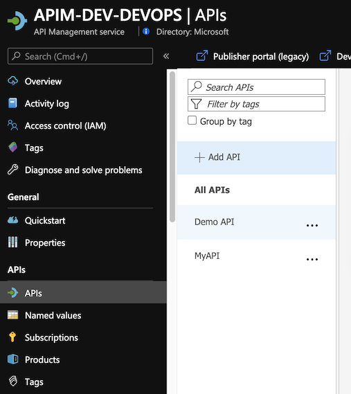

# Continuos Integration and Continuos Deployment using Azure DevOps - AzDO

The following instructions demonstrate how to deploy the contents of this example repository using Azure DevOps Repos and Azure DevOps Pipelines.

## Pre-reqs

To run this solution you will need:

- Azure DevOps Account
- An Azure DevOps Repo configured (how to configura an Azure DevOps Repo)
- For this solution, we will use 3 API Management deployed (Dev, QA and Production) 
- Some API(s) on your API Management 

## Architecture

We'll follow the same scenario presented on [README.md] file. 


## The proccess

This is one example how to use Azure DevOps Repo and Azure DevOps Pipelines to enable a Continuos Integration and Continuos Deploiment (CI/CD) for API's on a Azure API Management Service. There's other ways to do this, but this is a "Keep it Simple" to help you start. (Planning to have another version using Github and Github Actions soon).

This is our Development API management. In general, developers will create their API's on one instance of APIM to test it. 



Once a Developer create and test the API on API Management, it's time to extract these API's using this DevOps Resource Kit. 

To runn it:

<a name="extractor1"></a>

## Running the Extractor
Below are the steps to run the Extractor from the source code:
- Clone this repository and navigate to {path_to_folder}/src/APIM_ARMTemplate/apimtemplate 
- Restore its packages using ```dotnet restore```
- Make sure you have signed in using Azure CLI and have switched to the subscription containing the API Management instance from which the configurations will be extracted. 
```
az login
az account set --subscription <subscription_id>
```
#### Extractor Arguments

You have two choices when specifying your settings:
1. By using a json file with key-values where the keys matches the table below. Use the `extractorConfig` argument:
`extract --extractorConfig c:/temp/extractSettings.json`. [See more examples.](#extractorParameterFileExamples)
2. Pass the arguments on the command line. For instance `extract --sourceApimName my-feature-apim --destinationApimName company-stable-apim --resourceGroup my-feature-rg --fileFolder c:\temp\apim-extract --apiName MyFeatureV1Api`.

For this example we will only use the option #2

So, run the aplication with: 
```
dotnet run extract --sourceApimName <DEV-APIM-NAME> --destinationApimName <DESTINATION-APIM-NAME> --resourceGroup <RESOURCE-GROUP-NAME>  --fileFolder c:\temp\apim-extract.
```
Where: 

> **DEV-APIM-NAME:** API Management where you created your API
> **DESTINATION-APIM-NAME:** It's just a convention to set the DESTINATION-API-NAME in front of the generated files.
> **RESOURCE-GROUP-NAME:** Resource group where the DEV-APIM-NAME is hosted.

After execute the command above, you will see something similar to this:


Then you see the json files extracted: 


Now, push your to your Azure DevOps Repo 

```
git push 
```

Now lets create our Build Pipeline: 

Add these tasks to your build: 
- Get Sources
- Copy Publish Artifacts 
  


Configure the fields as show bellow:


Now you have a Build Pipeline which will pull your APIM JSON files and publish it to the Artifact folder on your Azure DevOps. 


